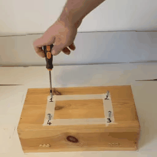

# Action recognizer: space-time models and an anomaly detection approach

The project aims to build different strategies to answer to the question: 
"Am I doing a particular action in the correct way?"

To this end I examine two approaches. First, I check the distribution of the embedding features 
obtained with space-time models such as R(2+1)D, SlowFast 3D ResNet and TimeSformer. 
Thus, I trained am anomaly detection algorithm putting an autoencoder on top of the pretrained space-time model.

## The dataset

I recorded myself with my smartphone posed on a tripod while 
I was performing ten different actions. In the following, the label, the corresponding meaning and a GIF example:

- screw: action of screwing a screw from a piece of wood


- unscrew: action of unscrewing a screw from a piece of wood


- screw_1234: action of screwing 4 screws in the sequence 1, 2, 3, 4


- screw_1432: action of screwing 4 screws in the sequence 1, 4, 3, 2


- screw_2413: action of screwing 4 screws in the sequence 2, 4, 1, 3


- screw_1342: action of screwing 4 screws in the sequence 1, 3, 4, 2



- screw_allenkey_1: action of screwing a screw from the position 1 of a chair


- screw_allenkey_2: action of screwing a screw from the position 2 of a chair


- unscrew_allenkey_1: action of unscrewing a screw from the position 1 of a chair


- unscrew_allenkey_2: action of unscrewing a screw from the position 2 of a chair


Each video has been registered in .MOV format with my Iphone.  They have a frame rate of 30 fps,  
a mean length of 15 seconds and dimensions (1080 x 1920). Furthermore, the dataset is structured such that
the videos are disposed in directories grouped by action as in the following way

    videos:
        action_1:
            video_1
            video_2
            video_3
            ...
        action_2:
            video_1
            video_2
            video_3
            ...
        action_3:
            video_1
            video_2
            video_3
            ...
        ...


Using the following script I convert the video from .Mov to .mp4
```bash
python preprocess/transform_dataset_from_mov_to_mp4.py --dir_mov_dataset <dir to the dataset with .MOV video> --dir_mp4_dataset <dir to the dataset with .mp4 video>
```

thus, using the following script I resize each video to a square format of 256x256 where the action is
centered on the video

```bash
python preprocess/transform_dataset_to_square_video.py --dir_rect_dataset <dir with rectangle dataset> --dir_square_dataset <dir with square dataset> --size <final square size>
```

Finally, I extract the csv corresponding to the dataset with the info about every video, such as its path,
the label and the class name both in english and italian. The csv is saved in the main directory of the dataset ant takes name "dataset.info.csv"

```bash
python preprocess/extract_classes_dataset.py
```


## Embedding distribution of space-time models

The first approach to evaluate if one or more action as well performed 
considers s pretrained spacetime models without its finetuning.
These models are pretrained in task such as action classification. Thus I consider the 
model without the final head classification such that for a clip video in input,
the corresponding output is the embedding representing the video in a n-dimensional vector space.


### Embeddings distribution with TSNE
With the following script I consider the embedding of all the clips video and their 
distribution over a 2d plane with TSNE. I can choose the number of frames to take for each video,
with the constraint that for the SlowFast 3D ResNet the number has fixed to 32, while for the  R(2+1)D 
and TimeSformer the number has to be a multiple of 8.

```bash
python find_embeddings_distribution.py --path_dataset <path to the square dataset> --path_csv_dataset <path to the csv> --list_classes <list of classes to consider separate by ','> --name_model <name of the model to use> --dir_storing_results <dir to store the results> --name_result_image <name to give to the image> --num_frames_to_sample 8
```
In the directory "results/TSNE" you can see some examples of distributions for each model by varying the number of frames

### Embeddings centroids

With the following script I study the distribution of the distances of the embeddings respect to the centroid of each class. In particular
I try to find some useful information about the distances distribution to check the existence of well separated categories of video
1) calculate the centroids of each class
2) for each centroid I calculate the distances separating it from all the embedding, grouping those distances by class.
3) for each embedding I consider the farthest point belonging to the same class of the centroid. Thus I check all the point inside this hypersphere and group their distance by class
4) for each embedding I consider the closes point not belonging to the same class of the centroid. Thus I check all the point inside this hypersphere and group their distance by class

```bash
python find_embeddings_centroid_and_distances.py --path_dataset <path to the square dataset> --path_csv_dataset <path to the csv> --name_model <name of the model to use> --dir_storing_results <dir to store the results> --num_frames_to_sample 8
```
In the directory "results/distances" you can see some examples of distributions for each model by varying the number of frames

## Anomaly detection

The second strategy consists into training an architecture made of the base space-time model and an autoecoder.
I train this architecture just on the category of interest in order to specialize the model 
into minimizing the recostruction error between the embedding array found by the base model and that reconstructed by the autoencoder.


### Data augmentation

The training of this kind of architecture require a lot of data. Thus I augment the dataset using the following script.
The augmented videos will be used to train the model and the original video will be use to test it
For each video I create a fixed number of synthetic video. The dataset structure is the same as the old one.
Inside the main folder of the dataset I create two csv, "df_train.csv" and "df_val.csv" to be used in the train and test dataloader

```bash
python preprocess/data_augmentation.py --dir_orig_dataset <directory of the square dataset> --dir_augment_dataset <directory of the augmented dataset> --n_applications <number of augmentation per video>
```

### Train and test

To run the training and test process use the script

```bash
python run_train_test.py --path_config_file <path to the config file>
```

The config file specifies all the setting for the train. In particular the field in the "class_to_recognize" I set the action
that will be used for the train. Furthermore in the field "num_frames_to_sample" I set the number of frame to sampling 
for each video during the training and, finally, with the "num_autoencoder_layers" I set the number of encoder and decoder hidden layers
and with "dim_autoencoder_layers" their number of nodes.

The training process uses the augmented video of the selected classes. The validation process uses the original video of the selected classes.
Once the model is trained, the best model is tested on all the original video of the dataset in order to check 
the distribution of the recostructed error for each category of action.

I found the best solution for the screwing action with the model R(2+1)D obtained with the training configuration
"configs/configs_autoencoder/avvitare/r2_plus_1/version_2.yaml". You can find the results at "results/r2plus1/avvitare/v2"

### Check classifier

Once the model is trained we can observe its behaviour in the full original dataset. With the following script 
we can print the error reconstruction plots and statistics both in normal and log scale. The scripts uses the 
reconstruction_error_dataset.csv saved at the end of the training process.

```bash
check_classifier_trained_model.py --dir_results <directory where is located the best model and its configuration file>
```

These infos are useful to choose the threshold value to decouple the desired action from all the others.
Once the threshold has been identified you can run the following command to find the classification report and confusion matrix
between the selected action and the most competitive one

```bash
check_classifier_trained_model.py --dir_results <directory where is located the best model and its configuration file> --theshorld <theshorld value> --log_scale <yes if the th, is in log scale> --reference_clas <the class of interest> --competitive_class <the class with which compare the desired class>
```

## Updates

I changed the function to load a video clip. Thus the dataloader use the Dataset_V2 class intead of the Dataset class in the data,py script


## Evironment

Build the environment based on python3.7
```bash
python3.7 -m venv venv
```

and install all the packages using

```bash
pip install -r requirements.txt
```
